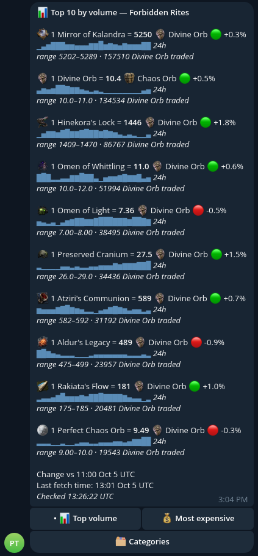
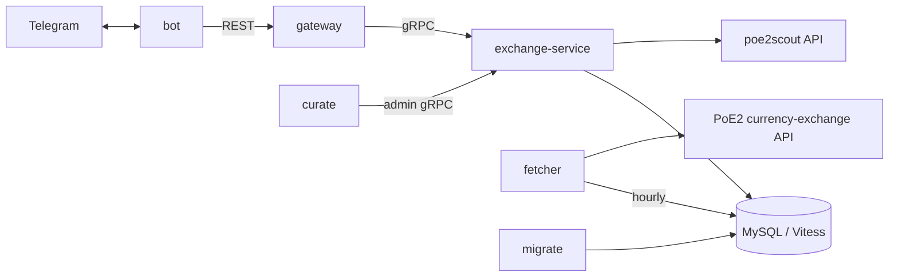

# PoE2 Exchange Tracker

[](https://github.com/grysha11/poe-tg-tracker/actions/workflows/test.yml)
[](https://github.com/grysha11/poe-tg-tracker/actions/workflows/docker.yml)


A private Telegram bot for Path of Exile 2 currency exchange rates. Every hour it pulls the official currency-exchange market data, stores it in MySQL, and serves ranked rates through a gRPC service and a REST gateway. Users get the result as one tap in Telegram.

[Features](#features) • [Architecture](#architecture) • [Getting started](#getting-started) • [Usage](#usage) • [REST API](#rest-api) • [Production](#production) • [Development](#development) • [Observability](#observability)

<details>
<summary>Screenshot</summary>
<br>

</details>

## Features

**For users**

- **Two ranked views**: *Top volume* (the most traded markets) and *Most expensive*, both priced in Divine Orbs.
- **Readable rates**: values below 1 are flipped (`1 Mirror = 410 Divine`, not `1 Divine = 0.0024 Mirror`). Rates without a direct Divine market are converted through Chaos or Exalted and marked `(via …)`.
- **Hourly change**: 🟢/🔴/⚪ percentage against the previous fetched hour.
- **Category filter**: pick which item categories (Currency, Runes, Essences, …) get ranked, from an inline keyboard.
- **Custom emoji** for each item through Telegram custom emoji packs.
- **Whitelist**: only listed Telegram user IDs can use the bot.

**Infrastructure**

- Go services built from one Docker image: bot, gRPC exchange-service, grpc-gateway REST API, hourly fetcher, `curate` admin CLI, and `migrate`.
- MySQL 8.4 in development and Vitess in production. Queries are type-checked with [sqlc](https://sqlc.dev), and the schema is versioned with [goose](https://github.com/pressly/goose) migrations embedded in the binary.
- Helm chart deployed by Argo CD. Images are built to GHCR, migrations run as a `PreSync` hook, and secrets are SealedSecrets.
- OpenTelemetry logs and traces over OTLP, Prometheus metrics, and probes that tell a DB outage apart from a dead process.
- Retries with backoff on every external call (DB, gRPC, gateway, poe2scout, exchange API, Telegram).
- GitHub Actions run gofmt, vet, a migration check and the race-enabled test suite against a real MySQL on every PR.

## Architecture



| Service | Role |
|---|---|
| `bot` | Telegram long-poll bot. Has no DB access and is a plain REST client of the gateway. |
| `gateway` | REST/JSON front door (grpc-gateway) that proxies to exchange-service. Only the read API is exposed. |
| `exchange-service` | Owns the DB. Serves the query API (rates, leagues, categories) and the admin API (curation, sync, bootstrap). |
| `fetcher` | Pulls one hour of market data from the official API and ingests it. Runs hourly at minute 1. |
| `curate` | Admin CLI for currency names, emoji and default rate pairs, talking to exchange-service over gRPC. |
| `migrate` | Applies pending goose migrations, then exits. |

The API contract lives in [`proto/exchange/v1`](proto/exchange/v1). SQL lives in [`internal/db/queries`](internal/db/queries), and the generated code goes to `internal/db/gen` and `internal/pb`.

## Getting started

The development environment is a local [minikube](https://minikube.sigs.k8s.io) cluster that runs the same Helm chart as production. Everything is driven by [Task](https://taskfile.dev).

### Prerequisites

- `minikube`, `kubectl`, `helm`, `docker` and `task`
- Go 1.27+ for running tests and code generation
- A Telegram bot token from [@BotFather](https://t.me/BotFather)

### Configure

```sh
cp .env.example .env
```

`task secrets:dev` builds the dev Secret from `.env`, and `task dev:up` runs it for you.

| Variable | Required | Description |
|---|---|---|
| `TELGRAM_BOT_TOKEN` | yes | Bot token. Note the key's spelling: `TELGRAM`, not `TELEGRAM`. |
| `WHITELIST` | yes | Comma-separated Telegram user IDs, e.g. `123,456`. The bot refuses to start without it. |
| `MYSQL_ROOT_PASSWORD` | yes | Root password for the in-cluster dev MySQL. |
| `POE_LEAGUE` | | Default league, e.g. `Forbidden Rites`. |
| `POE_CONTACT` | | Contact string sent in the User-Agent to the PoE API. |
| `LOG_LEVEL` | | `debug`, `info`, `warn` or `error`. |
| `OTEL_EXPORTER_OTLP_ENDPOINT` | | OTLP/gRPC collector for logs and traces. |
| `DB_CONNECT_TIMEOUT` | | How long to retry the first DB ping. Defaults to `60s`. |
| `DB_DSN`, `GATEWAY_ADDR`, `EXCHANGE_SERVICE_ADDR` | | Only needed when running a binary directly on the host. The chart sets them inside the cluster. |

> [!TIP]
> To add a user, ask them to message the bot. Copy their `user_id` from the `rejected message: user not whitelisted` log line, add it to `WHITELIST`, and run `task helm:dev-install` again.

### Run

```sh
task dev:up          # start minikube, build the image, helm install, run migrations
task dev:bootstrap   # seed the DB: curate sync + curate bootstrap
task dev:fetch-once  # fetch the current hour now instead of waiting for the cron
```

`dev:up` builds the image directly inside minikube's Docker daemon, so no registry is involved. It installs the chart into the `poe-tracker-dev` namespace of the `poetracker` profile with [`values.dev.yaml`](deploy/poe-tracker/values.dev.yaml): an in-cluster MySQL instead of Vitess, a plain Secret instead of SealedSecrets, and `pullPolicy: Never`.

> [!IMPORTANT]
> The dev MySQL uses an `emptyDir` volume, so its data is lost whenever the pod is recreated. Run `task dev:bootstrap` after every fresh `dev:up`. Until the DB has default rate pairs and one fetched hour, `/rates` replies with an error.

### Day-to-day tasks

```sh
task dev:watch           # rebuild and redeploy on every Go change
task helm:dev-install    # rebuild and redeploy once
task dev:logs            # tail the bot
task dev:gateway-forward # gateway on localhost:8080
task dev:mysql-forward   # dev MySQL on localhost:3307
task dev:migrate         # run pending migrations (dev:up and dev:watch already do this)
task dev:smoke           # wait for the rollout and check it came up healthy
task dev:down            # remove the release, keep the cluster
task dev:destroy         # remove everything, including the cluster
task minikube:stop       # stop the cluster without deleting it
```

Run `task --list` to see every task.

<details>
<summary>Without Kubernetes: docker compose</summary>

[`docker-compose.yaml`](docker-compose.yaml) runs the same services with MySQL, a one-shot `migrate` service and an [Ofelia](https://github.com/mcuadros/ofelia) scheduler for the hourly fetch. Data is stored in the `poetracker-mysql-data` volume, and the gateway is on `127.0.0.1:8080`.

```sh
docker compose up --build
docker compose run --rm bot ./curate sync
docker compose run --rm bot ./curate bootstrap
docker compose exec bot ./fetcher
```

</details>

## Usage

### Bot commands

| Command | |
|---|---|
| `/start`, `/help` | Intro and the rates keyboard |
| `/rates` | Top rates for the latest fetched hour |
| `/leagues` | League names seen in the latest hour |

Everything else happens through the inline keyboard: switch views, open 🗂 Categories, and refresh.

### Fetcher

`task dev:fetch-once` fetches the latest hour. To backfill a specific hour, pass a unix timestamp:

```sh
kubectl -n poe-tracker-dev exec deploy/poe-tracker-dev -- ./fetcher -hour 1791028800
```

The exchange API sometimes serves the previous hour's payload again. The fetcher catches this with a payload hash stored in `fetch_log`, so it keeps no local state.

### Curate

The raw API only returns internal item paths. `curate` gives them display names, trade IDs and emoji. It ships in the image, so run it inside the bot pod:

```sh
kubectl -n poe-tracker-dev exec deploy/poe-tracker-dev -- ./curate list   # currencies still waiting for curation
kubectl -n poe-tracker-dev exec deploy/poe-tracker-dev -- ./curate set -path <item_path> -trade-id <id> -name <name> [-emoji <id>]
kubectl -n poe-tracker-dev exec deploy/poe-tracker-dev -- ./curate sync   # bulk-upsert names and categories from poe2scout
```

`sync` keeps emoji IDs you have already curated. Run it again whenever a new league adds items. In production, use namespace `poe-tracker` and `deploy/poe-tracker`.

## REST API

The gateway is generated from [`query.proto`](proto/exchange/v1/query.proto) with grpc-gateway:

```
GET /v1/rates?league=<league>&view=RATE_VIEW_VOLUME|RATE_VIEW_PRICE&limit=<n>&categories=<category>...
GET /v1/leagues
GET /v1/rate-pairs/default
GET /v1/categories
GET /healthz   # liveness
GET /readyz    # readiness, which checks exchange-service's gRPC health
```

All parameters are optional. `league` defaults to `POE_LEAGUE`, `view` to volume, and `limit` to 10. Following protojson, 64-bit integers such as `hourUtc` and `baseVolume` are encoded as JSON strings.

> [!WARNING]
> The gateway has no authentication. The Service is ClusterIP-only; reach it with `task dev:gateway-forward`. Add auth before you expose it outside the cluster.

## Production

Production is handled by GitOps with the Helm chart in [`deploy/poe-tracker`](deploy/poe-tracker). A push to `main` builds `ghcr.io/grysha11/poe-tg-tracker:<sha>`, and the workflow commits the new tag to `values.yaml`. Argo CD then syncs the chart:

- The `poe-tracker-migrate` Job runs as a `PreSync` hook with the new image. If it fails, the sync stops and the old pods keep serving. A failed Job is kept until the next sync so you can read its logs.
- The fetcher is a CronJob (`1 * * * *`).
- The database is the homelab's Vitess, reached through an `ExternalName` Service for vtgate.
- Secrets are SealedSecrets.

## Development

### Tests

DB-backed tests run the migrations and then truncate every table, so they need a disposable MySQL:

```sh
task test:db        # starts mysql:8.4 on :3307 if needed, runs go test -p 1 ./...
task test:db-down   # stops it
```

> [!CAUTION]
> Never point `TEST_DB_DSN` at the minikube or compose MySQL, because the tests wipe it. `-p 1` is required: every DB package truncates the same database, so packages can't run in parallel.

CI ([`test.yml`](.github/workflows/test.yml)) runs the same suite with `-race` on every pull request and every push to `main`. It also checks gofmt, `go vet`, and that the migrations apply to an empty database.

### Schema changes

Migrations are goose SQL files in [`internal/db/migrations`](internal/db/migrations), embedded into `migrate` so each image carries exactly the schema its code expects. Never edit a migration that is already deployed. Add a new one instead:

```sh
goose -dir internal/db/migrations create <name> sql -s
sqlc generate
```

- Start each file with `-- +goose NO TRANSACTION`, since MySQL DDL auto-commits.
- Prefer `ALGORITHM=INSTANT` for adding columns.
- `SELECT *` is safe inside `internal/db/queries`, because sqlc expands it into an explicit column list. Keep hand-written `SELECT *` out of Go code.

### Protobuf

```sh
task proto:gen   # builds the pinned plugins into .tools/, runs buf generate
```

### Project layout

```
cmd/                 one main package per binary
internal/
  db/                connection, migrations, sqlc queries and generated code
  exchange/          exchange API client, rate math and ranking
  exchangesvc/       gRPC query and admin servers
  ingest/            hourly payload into market snapshots
  gatewayclient/     REST client used by the bot
  telegram/          minimal Bot API client
  telemetry/         OpenTelemetry setup (logs, traces, metrics)
  retry/, grpcclient/, poe2scout/, emoji/, config/
proto/               API contract
deploy/poe-tracker/  Helm chart
docs/                benchmarks and notes
```

## Observability

Every binary sets up OpenTelemetry through [`internal/telemetry`](internal/telemetry).

### Logs

Logs are always JSON on stdout. Each line carries `service`, `service_version` (the image tag), and, when logged inside a request, `trace_id` and `span_id`. With `grep` you can follow one request across the bot, gateway and exchange-service even without a trace backend. When `OTEL_EXPORTER_OTLP_ENDPOINT` is set, the same records also go over OTLP to the collector (Alloy, then Loki).

> [!NOTE]
> Don't let the collector tail these pods' stdout as well, or every line will arrive twice.

### Traces

Spans go to the same OTLP endpoint (Alloy, then Tempo). Sampling is always-on by default; override it with `OTEL_TRACES_SAMPLER`. One button tap produces one trace:

```
bot.callback                                       (bot)
├── GET /v1/rates                                  bot -> gateway
│   └── exchange.v1.ExchangeQueryService/GetRates  gateway -> exchange-service
│       └── ListDefaultRatePairs, ...              SQL spans, named by sqlc query
├── telegram answerCallbackQuery
└── telegram editMessageText
```

Telegram spans are named by API method, never by URL, so the bot token is never recorded. Some things are left out on purpose: health checks, probes, the `getUpdates` long poll, and the roughly 2,800 per-market inserts in each fetch.

### Metrics

The bot, exchange-service and gateway serve Prometheus metrics on `:9464/metrics`. When `metrics.serviceMonitor.enabled` is set, the chart creates ServiceMonitors and a PodMonitor. Their `labels` must match your Prometheus selectors.

<details>
<summary>Metric reference</summary>

| Metric | Source |
|---|---|
| `rpc_server_call_duration_seconds` | exchange-service, by `rpc_method` and status code |
| `rpc_client_call_duration_seconds` | gateway to exchange-service |
| `http_server_request_duration_seconds` | gateway REST API (probes excluded) |
| `http_client_request_duration_seconds` | outbound HTTP from the bot, exchange API and poe2scout clients |
| `db_client_operation_duration_seconds` | every SQL call, with `db_query_name` set to the sqlc query name |
| `db_sql_connection_*` | connection pool |
| `poetracker_last_fetch_timestamp_seconds` | last successful fetcher run |
| `poetracker_latest_snapshot_hour_seconds` | newest snapshot hour for `POE_LEAGUE` |
| `poetracker_placeholder_currencies` | currencies waiting for `curate` |
| `poetracker_scout_sync_currencies_total` | `curate sync` results |
| `poetracker_bot_commands_total`, `_callbacks_total`, `_rejected_total`, `_getupdates_errors_total` | bot usage |
| `poetracker_telegram_requests_total`, `poetracker_telegram_request_duration_seconds` | Telegram Bot API, by method |
| `poetracker_retries_total` | retries by `client` and `outcome` (`retry`, `recovered`, `exhausted`) |

</details>

> [!TIP]
> The fetcher is a short-lived CronJob and isn't scraped. Alert on `time() - poetracker_last_fetch_timestamp_seconds > 7200` instead.

### Probes and retries

- **exchange-service**: readiness reports `SERVING` only while a DB ping, run every 10s, succeeds. Liveness doesn't depend on the DB, so during an outage the pod is taken out of the Service instead of being restarted.
- **gateway**: `/readyz` checks exchange-service (and so the DB). `/healthz` only checks the process.
- **bot**: `/healthz` fails only if the poll loop stalls for 3 minutes, so a Telegram outage never restarts it. `/readyz` needs a successful `getUpdates` in the last 3 minutes and a ready gateway.
- **Retries**:
  - DB connect: up to `DB_CONNECT_TIMEOUT`.
  - gRPC: up to 4 attempts on `UNAVAILABLE`.
  - Bot to gateway: 3 attempts on network errors and 502/503/504.
  - poe2scout: 4 attempts per page, honoring `Retry-After`.
  - Fetcher: 6 attempts.
  - Telegram sends: retried only on 429 and 5xx, so a dropped connection never causes a duplicate message.
